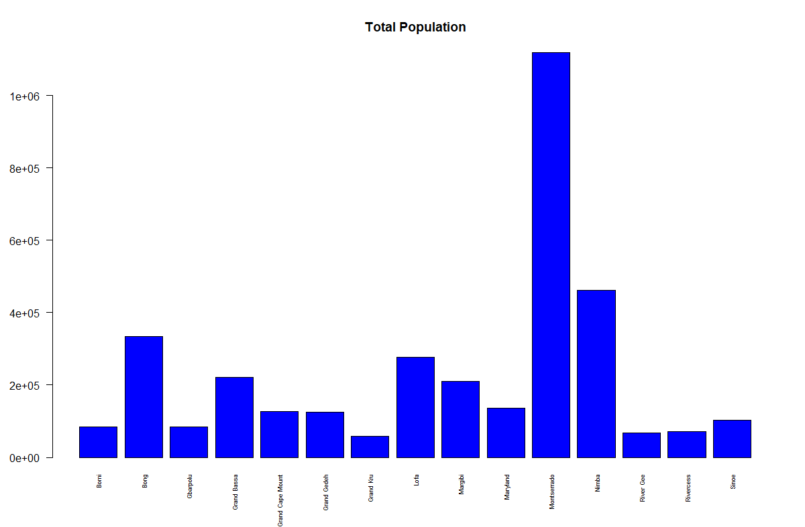
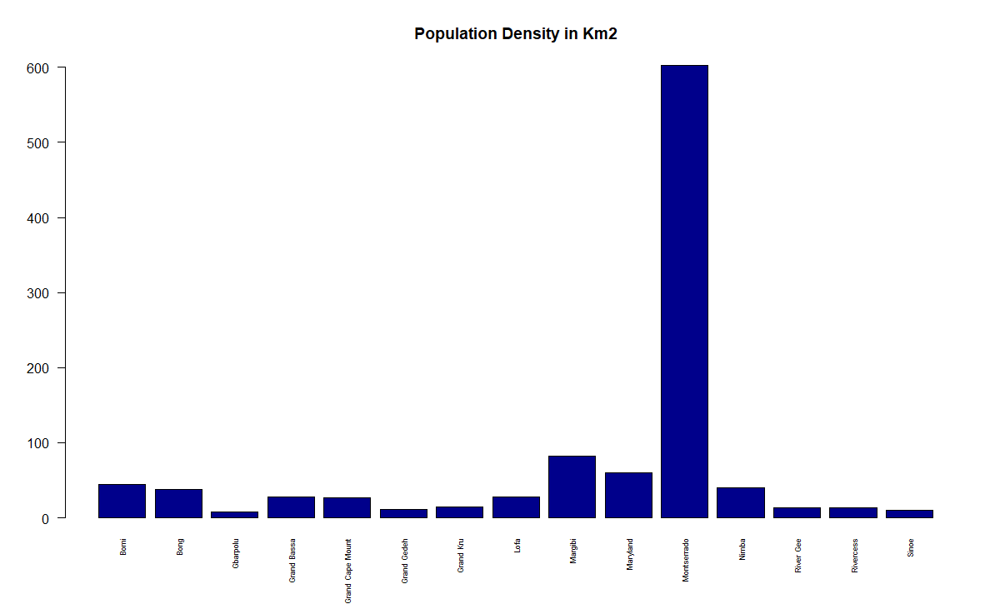
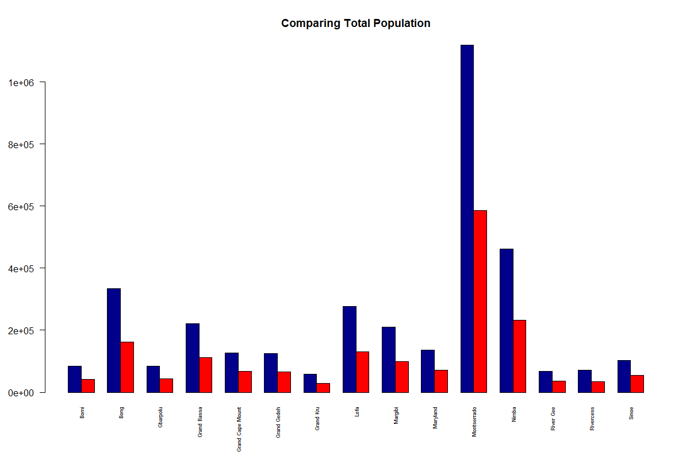
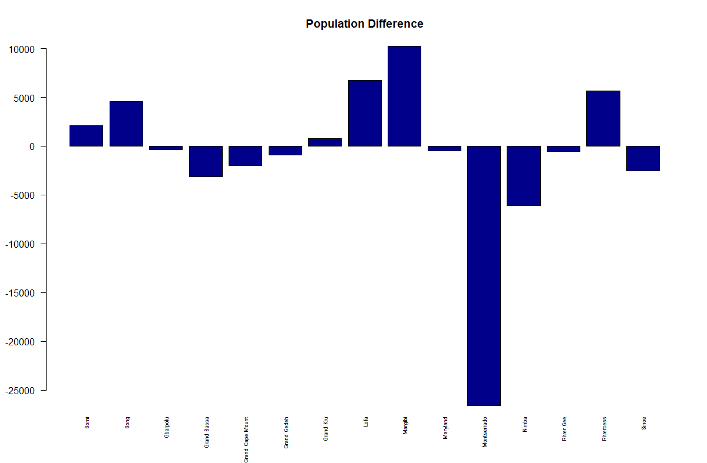
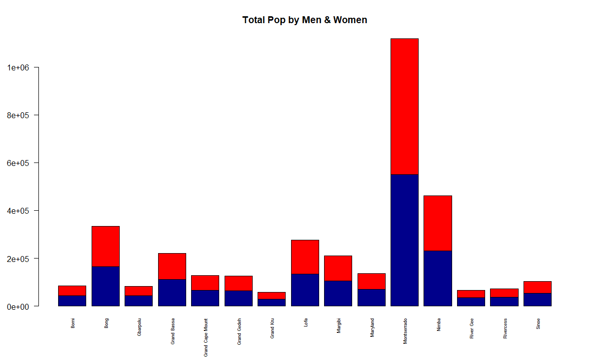
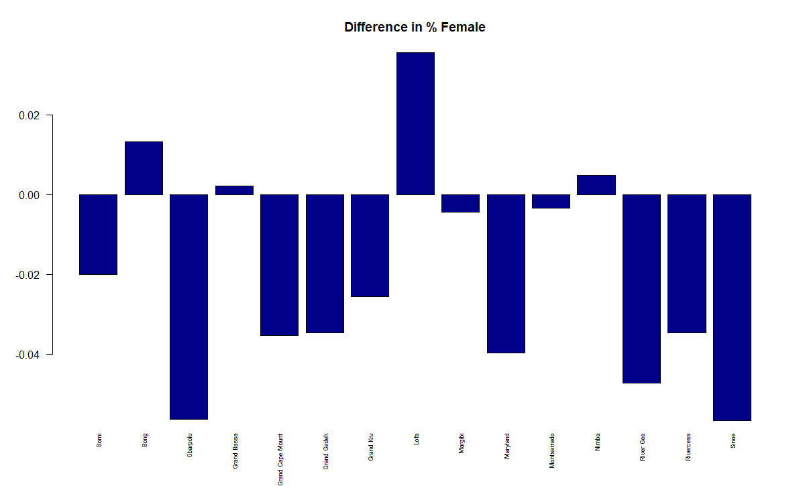

# Bar Graphs Desciribing Population in Liberia by County

1. Total Population by County

2. Population Density by County

3. Comparing Population Between Source (Blue) and Remote (red)

4. Diffrence in Population Between Data Sets (Source - Remote)

5. Comparing Population of Men (Blue) and Women (Red)

6. Diffrence in Percentage of Population that is Female (Source - Remote)

