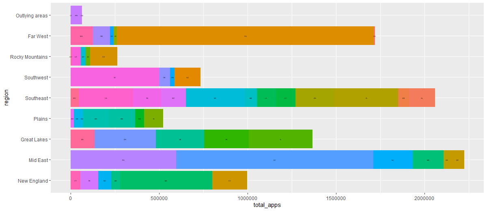
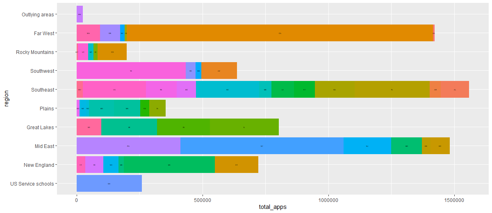

# Project 1, Part 1

This graph represents the number of applications to four year collegs. It is broken down by region and then by state.

This graph represents the number of appications to collegs that offer doctorates. It is broken down by region and then by state.

