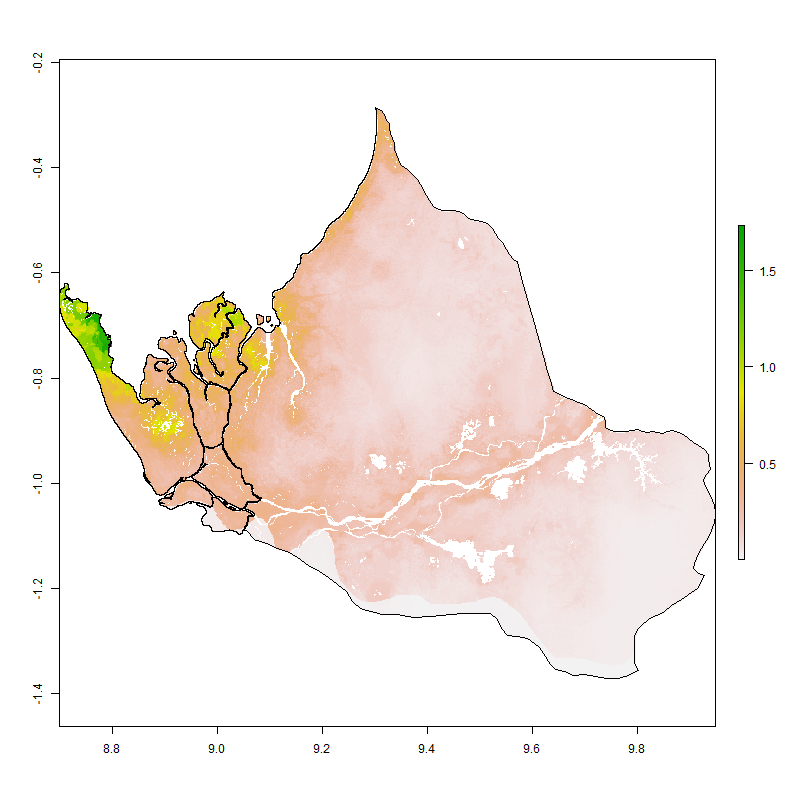
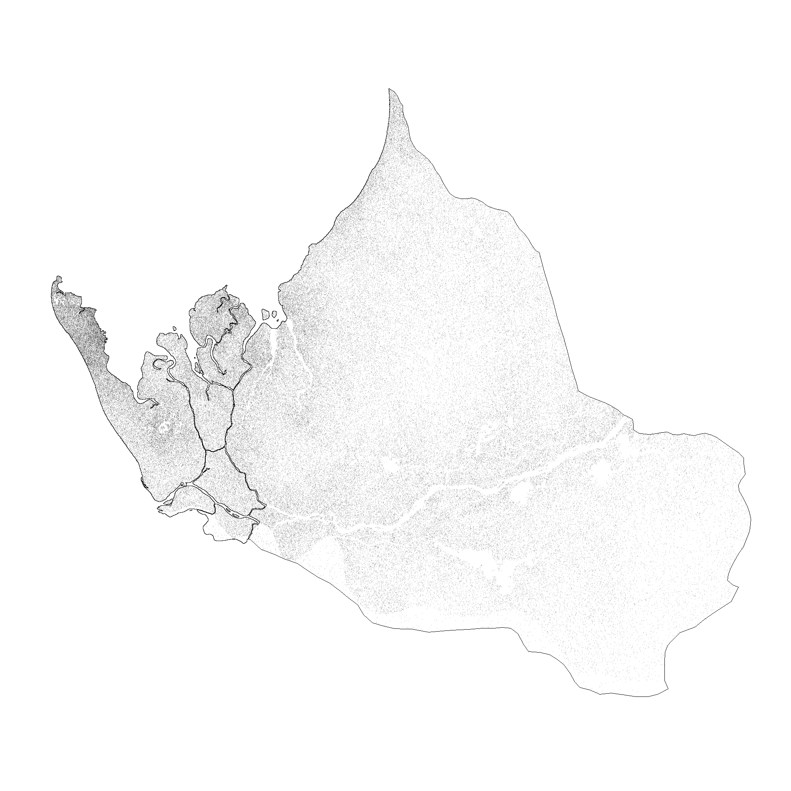
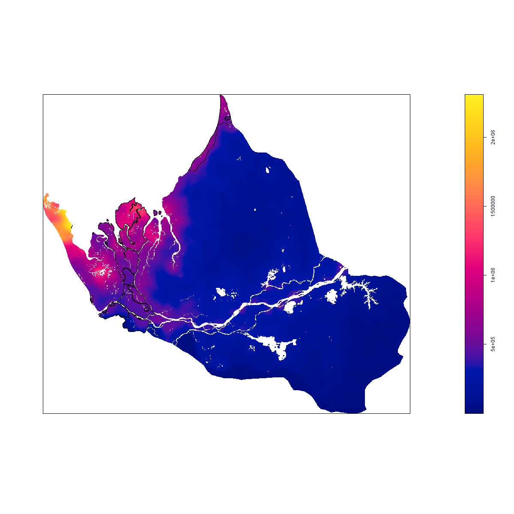
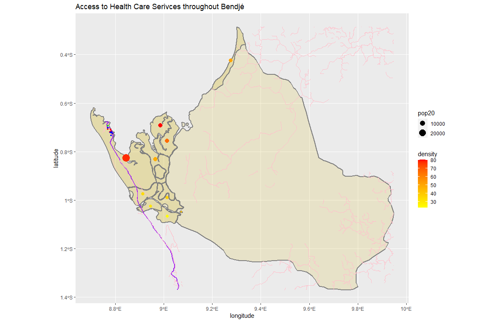

# Final Project

# Accessibility 1
This plot shows the population distribution of Bendjé, Gabon.

This plot shows the population density of Bendjé, Gabon with dots.

This plot shows a a prediction of the population of Bendjé, Gabon based on the above dot plot.

This plot highlights the most urbanized areas in Bendjé, Gabon.

# Accessibility 2

This plot shows the access to medical services in Bendjé, Gabon. The purple line represents the main road and the pink lines are a network of tracks. The small dots in the Northwest represent medical centers. The red dots represent clinics, the blue dots are pharmacies, and the green dot represents a doctor's office.

There is very little access to medical care in Bendjé, Gabon. The few medical services are only avalible in the most populous area leaving those in rural areas without any relable medical services.

# Accessibility 3
![]#3DPlot
