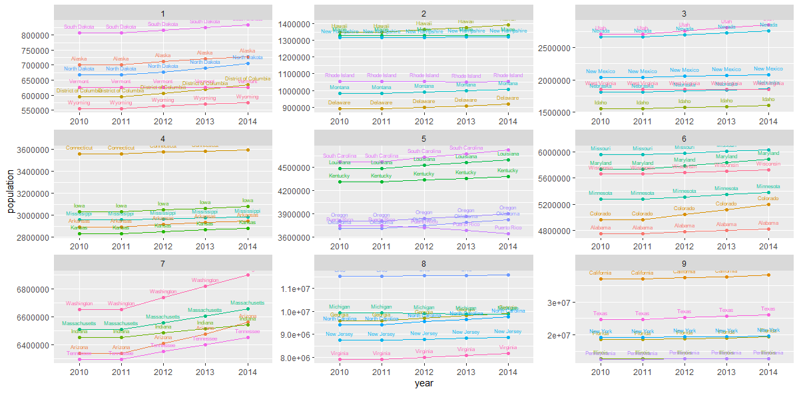
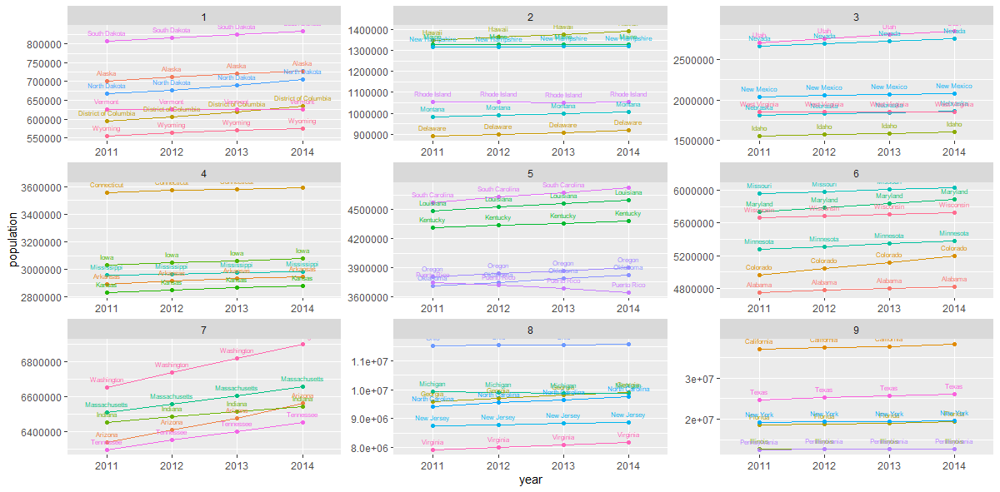

# Project 2, Part 1

This graph shows the changes in population for each US state, Washington DC, and Puerto Rico every year from 2010 to 2014. The data is diveded in 9 separate graphs to increase readablility. 

This graph shows the growth rate of the population each US state, Washington DC, and Puerto Rico every year from 2010 to 2014. The data is diveded in 9 separate graphs to increase readablility. 

