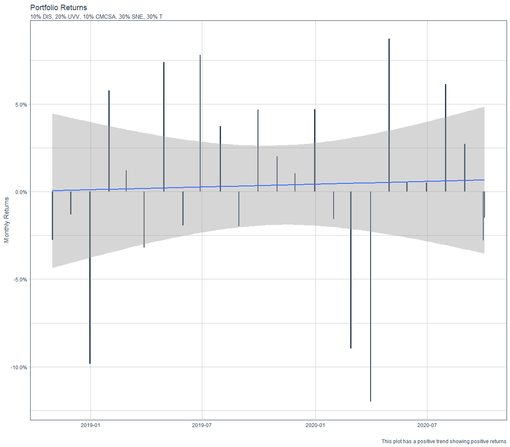
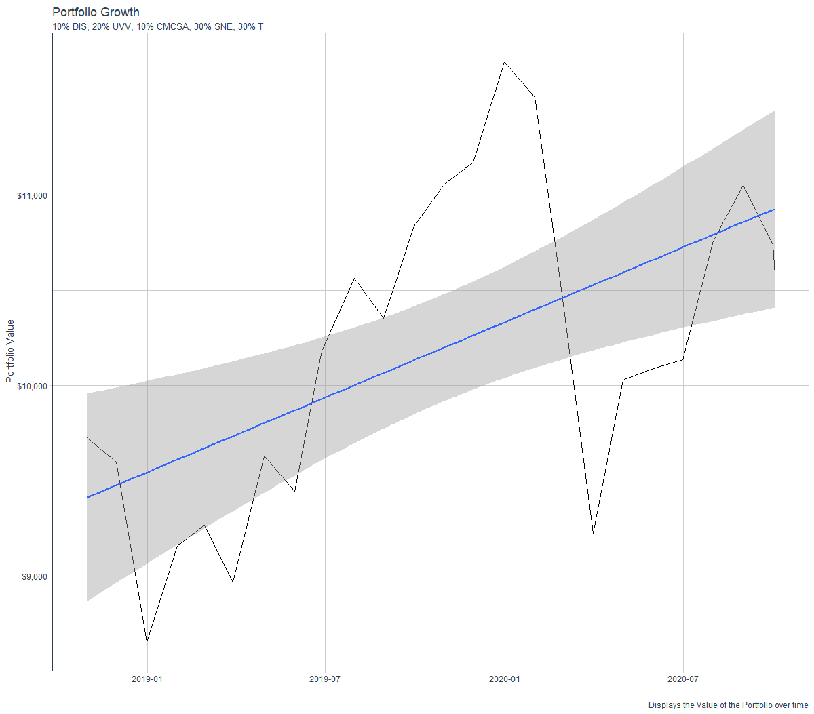

# Project 2 Part 3

This graph shows the monthly returns of a portfolio containing the stock for Disney, Universal, Comcast, Sony, and AT&T. The total investment was $10,000 and the percent invested in each stock is listed.

This graph shows the growth of the same portfolio.

