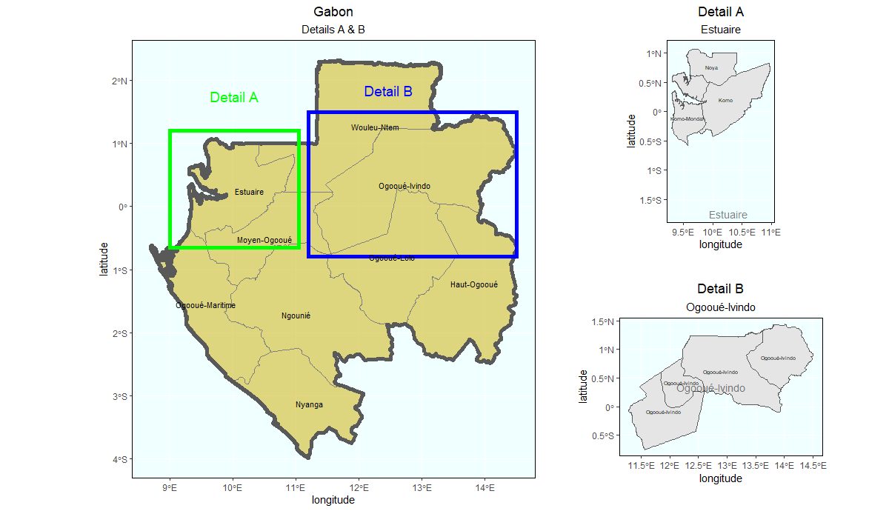

# Project 3 Part 1

This is a map of Gabon divided into its nine provinces and then 50 departments.

This is a map of Estuaire, the most populous province in Gabon.

This map of Gabon higlights two provinces. In the green box is Detail A, Estuaire, the most populous province in Gabon. In the blue box is Detail B, Ogooué-Ivindo, one of the least densley populated and least devloped provinces in Gabon.

