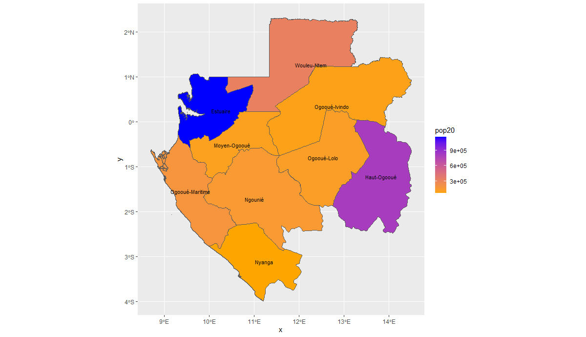
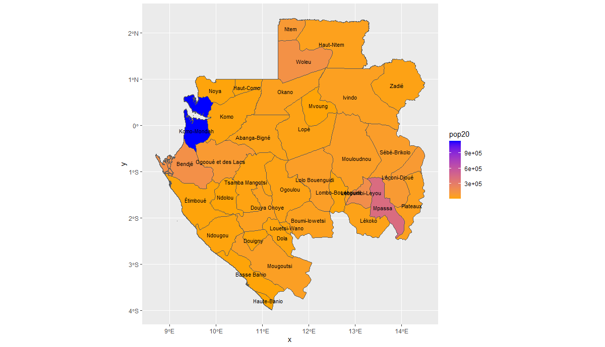
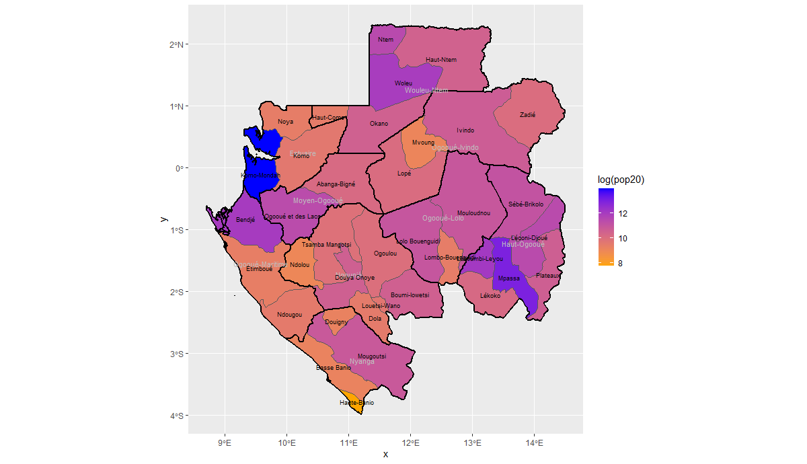
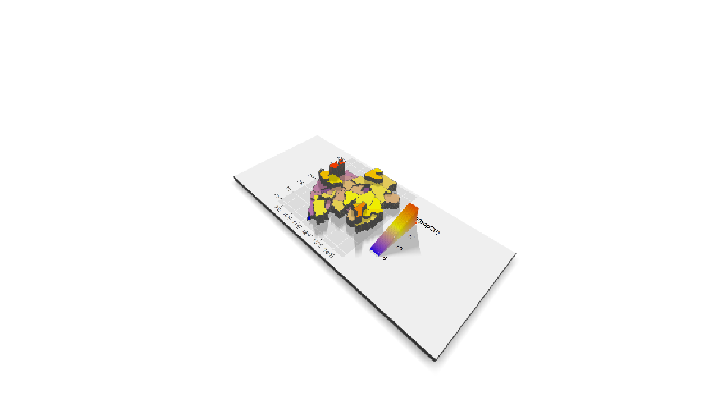

# Project 4

This is a map of Gabon's provinces color coded by population.

This is a mab of each of Gabon's departments color coded by population.

This map combines the previous two in oder to more clearly show the population distribution of Gabon

This is a 3D model of the above map of Gabon.

