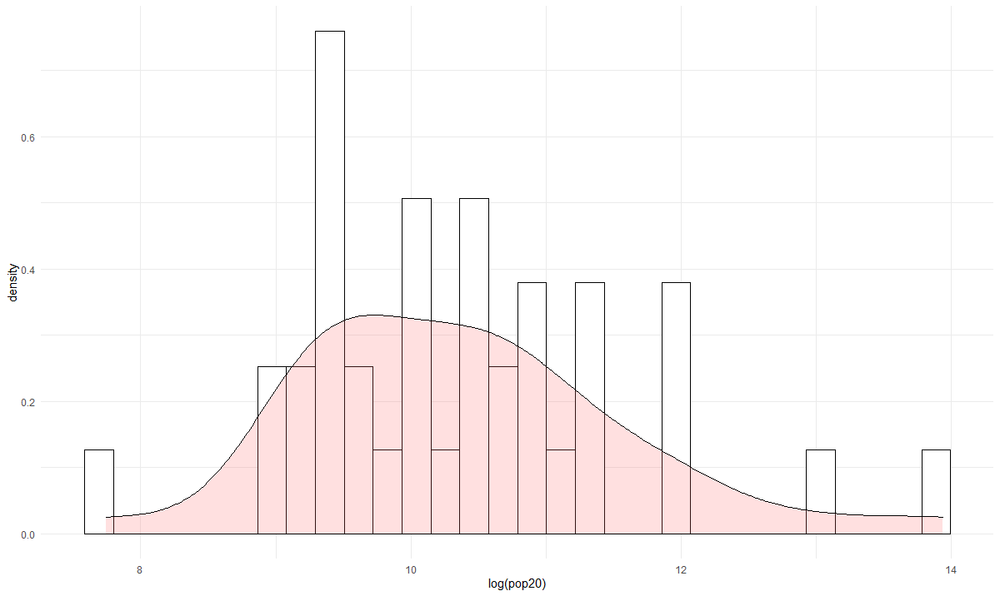
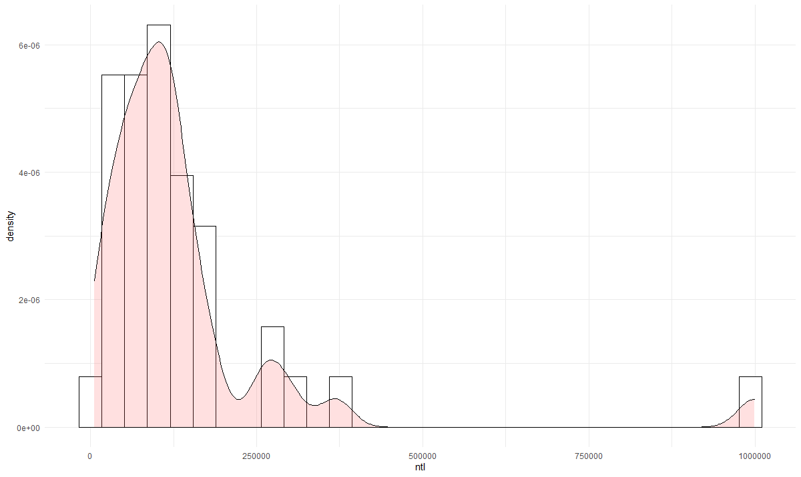

# Project 5

This histogram shows the poplution density of the subdivisions of Gabon.

This histogram represents the amount of light that can be seen at night from above Gabon. This can be used to estimate both population and the ammount of development in the area.

